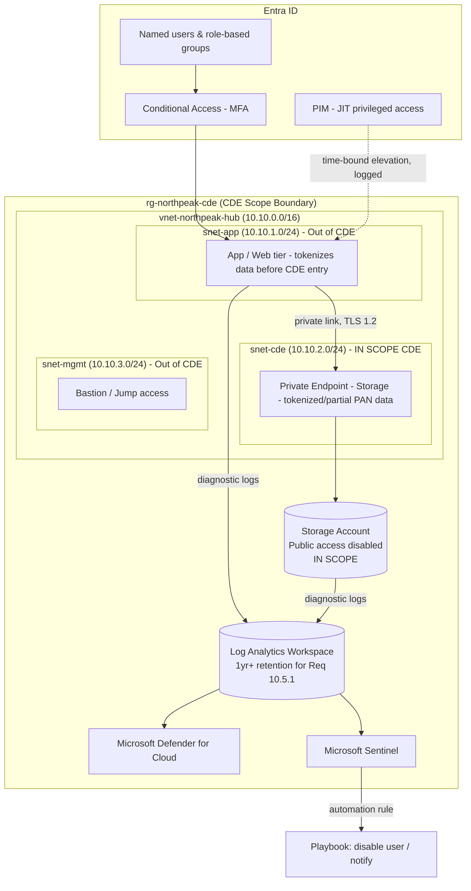

# Secure Azure Landing Zone — PCI DSS v4.0 Cardholder Data Environment (CDE)

**A hands-on portfolio project demonstrating Azure network segmentation, identity governance, and Microsoft Defender for Cloud / Sentinel detection engineering, mapped explicitly to PCI DSS v4.0 requirements.**

> Note on scope: this project builds the *surrounding control environment* (network segmentation, access control, logging, monitoring) that a real Cardholder Data Environment requires. It does not process, transmit, or store real primary account numbers (PANs) — the "cardholder data" here is synthetic/tokenized test data, which is a standard and expected practice for a portfolio/lab build. Call this out explicitly in your own README so it reads as informed, not naive.

---

## 1. Business Scenario

**Company:** NorthPeak Payments — a fictional Level 4 merchant service provider (small e-commerce processor, <20,000 transactions/year) preparing for its first PCI DSS v4.0 Self-Assessment Questionnaire (SAQ D) ahead of a payment-processor partnership audit.

**Context:**
- 5-person engineering team, no dedicated security/compliance hire yet — you are doing the initial control build before bringing in a Qualified Security Assessor (QSA) for validation.
- The platform stores tokenized transaction records and partial PAN (last 4 digits) for customer support lookups; full PAN and CVV are never stored (data minimization — see Requirement 3 mapping below).
- The processing partner has sent a pre-audit checklist requiring evidence of: network segmentation isolating the CDE, strong access control with MFA, logging/monitoring of the CDE, and a documented incident response capability.
- Budget and headcount are those of a startup — this is a single-subscription proof of concept scoped to demonstrate the *pattern* of PCI-aligned controls, not a QSA-validated production CDE (the gap is called out explicitly in Section 12).

**Problem statement:** Build an Azure environment where the CDE is network-isolated from the rest of the estate, access to it requires MFA and just-in-time privilege elevation, all activity is logged to a retained, tamper-evident location, and suspicious authentication activity against the CDE is detected and responded to automatically — then prove it by deliberately introducing PCI-relevant misconfigurations and watching Defender for Cloud flag them before an assessor would.

**Why this framing works well for a portfolio:** PCI DSS is one of the few frameworks where the *requirement numbers* give you a ready-made structure for a README — every control you build can cite the exact requirement it satisfies, which reads as far more credible than "I did some security stuff."

---

## 2. PCI DSS v4.0 Requirement → Azure Control Mapping

Lead your README with this table. It's the single artifact a reviewer (or a recruiter who knows PCI) will look at first.

| PCI DSS v4.0 Requirement | Control Built | Where (Section) |
|---|---|---|
| **Req 1** — Network security controls | VNet segmentation isolating CDE subnet; NSGs enforcing least-privilege inbound/outbound | §4 Steps 2–3 |
| **Req 2** — Secure configurations | Storage account hardened (TLS 1.2 min, public access disabled, no default configs) | §4 Step 4 |
| **Req 3** — Protect stored account data | Public access disabled + private endpoint only; no full PAN stored (data minimization) | §4 Step 4 |
| **Req 4** — Protect data in transit | TLS 1.2 enforced on storage; HTTPS-only NSG rules | §4 Steps 3–4 |
| **Req 7** — Restrict access by business need-to-know | Role-based groups, RBAC scoped to CDE resource group only | §4 Step 5 |
| **Req 8** — Identify users & authenticate access | Conditional Access requiring MFA outside trusted network; unique named accounts (no shared logins) | §4 Step 6 |
| **Req 8.2 / 7.2.4** — Privileged access review & least privilege | PIM eligible (not standing) role assignments, time-bound activation | §4 Step 7 |
| **Req 10** — Log and monitor all access | Azure Monitor → Log Analytics; sign-in, audit, storage, and NSG flow logs centralized | §4 Step 10 |
| **Req 10.2 / 10.4** — Automated log review, daily review of security events | KQL scheduled analytics rule for repeated failed logins | §4 Step 11 |
| **Req 10.7 / 12.10** — Incident response, alerting | Sentinel automation rule triggering response on alert | §4 Step 12 |
| **Req 11.3** — Vulnerability/misconfiguration scanning | Defender for Cloud continuous assessment (demonstrated via §6) | §6 |
| **Req 6.4 / 12.10.5** — Change control, documented response | Remediation change log | §7 |

---

## 3. Architecture Overview



**Segmentation principle (Req 1.2 / 1.3):** `snet-cde` is the only subnet in PCI scope. Everything not explicitly required to store, process, or transmit cardholder data — including your management/bastion path — sits outside the CDE boundary specifically so it doesn't drag the whole subscription into audit scope. This is the single biggest lever a small team has to keep PCI compliance affordable: minimize what's in scope, not just secure everything equally.

---

## 4. Step-by-Step Build

### Step 1 — Deploy the CDE resource group with a delete lock

```bash
az group create --name rg-northpeak-cde --location eastus

az group lock create --name lock-no-delete --resource-group rg-northpeak-cde \
  --lock-type CanNotDelete
```

**Maps to:** Req 12.10 (incident response readiness assumes the environment can't be destroyed by an attacker covering tracks) and general change-management hygiene under Req 6.

---

### Step 2 — Virtual network with CDE segmentation (Req 1.2, 1.3)

```bash
az network vnet create \
  --resource-group rg-northpeak-cde \
  --name vnet-northpeak-hub \
  --address-prefix 10.10.0.0/16 \
  --subnet-name snet-app --subnet-prefix 10.10.1.0/24

az network vnet subnet create -g rg-northpeak-cde --vnet-name vnet-northpeak-hub \
  --name snet-cde --address-prefix 10.10.2.0/24

az network vnet subnet create -g rg-northpeak-cde --vnet-name vnet-northpeak-hub \
  --name snet-mgmt --address-prefix 10.10.3.0/24
```

| Subnet | PCI Scope | Purpose | Why isolated |
|---|---|---|---|
| `snet-app` | Out of scope (tokenizes before forwarding) | Application tier | First point of contact for user traffic; tokenizes/truncates data before anything crosses into `snet-cde` |
| `snet-cde` | **In scope — CDE boundary** | Private endpoint to storage holding tokenized/partial PAN data | Nothing routes here except the app tier over an explicitly allowed path; this is the subnet an assessor would draw the scope line around |
| `snet-mgmt` | Out of scope | Bastion/jump access | Admin path kept deliberately outside the CDE so admin credential compromise doesn't automatically equal CDE compromise |

**What it protects against:** Req 1's core intent — an attacker who compromises the public-facing app tier still has to cross a second, explicitly-controlled boundary to reach cardholder data. Flat networks are the most common reason small merchants fail segmentation testing.

---

### Step 3 — NSGs with least privilege (Req 1.2.1, 1.3.1, 1.4.3)

```bash
az network nsg create -g rg-northpeak-cde -n nsg-snet-app
az network nsg create -g rg-northpeak-cde -n nsg-snet-cde
az network nsg create -g rg-northpeak-cde -n nsg-snet-mgmt

# App subnet: HTTPS in from internet only
az network nsg rule create -g rg-northpeak-cde --nsg-name nsg-snet-app \
  --name Allow-HTTPS-In --priority 100 --direction Inbound --access Allow \
  --protocol Tcp --destination-port-ranges 443 --source-address-prefixes Internet

# CDE subnet: inbound 443 ONLY from the app subnet — this is the segmentation control an assessor tests
az network nsg rule create -g rg-northpeak-cde --nsg-name nsg-snet-cde \
  --name Allow-App-To-CDE-Only --priority 100 --direction Inbound --access Allow \
  --protocol Tcp --destination-port-ranges 443 --source-address-prefixes 10.10.1.0/24

az network nsg rule create -g rg-northpeak-cde --nsg-name nsg-snet-cde \
  --name Deny-All-Other-Inbound --priority 4096 --direction Inbound --access Deny \
  --protocol '*' --destination-address-prefixes '*'

az network nsg rule create -g rg-northpeak-cde --nsg-name nsg-snet-cde \
  --name Deny-All-Outbound --priority 4096 --direction Outbound --access Deny \
  --protocol '*' --destination-address-prefixes '*'

# Management subnet: Bastion only, no open RDP/SSH to the internet (Req 2.2.7, 8.3.1 support)
az network nsg rule create -g rg-northpeak-cde --nsg-name nsg-snet-mgmt \
  --name Allow-Bastion-Only --priority 100 --direction Inbound --access Allow \
  --protocol Tcp --destination-port-ranges 3389 22 --source-address-prefixes AzureBastionSubnet

az network vnet subnet update -g rg-northpeak-cde --vnet-name vnet-northpeak-hub \
  --name snet-app --network-security-group nsg-snet-app
az network vnet subnet update -g rg-northpeak-cde --vnet-name vnet-northpeak-hub \
  --name snet-cde --network-security-group nsg-snet-cde
az network vnet subnet update -g rg-northpeak-cde --vnet-name vnet-northpeak-hub \
  --name snet-mgmt --network-security-group nsg-snet-mgmt
```

**Why the explicit deny-all rules, when NSGs already deny by default:** PCI assessors specifically look for *documented, explicit* deny rules rather than reliance on implicit defaults — Req 1.2.7 requires configurations to be reviewed and justified, and an explicit rule is self-documenting evidence in a way an implicit default isn't.

**What it protects against:** Direct internet exposure of admin protocols, and — the control an assessor actually tests during segmentation testing — any network path into the CDE subnet that bypasses the app tier.

---

### Step 4 — Storage account hardened, private endpoint only (Req 1.3, 2.2, 3, 4.2.1)

```bash
az storage account create -g rg-northpeak-cde -n stnorthpeakcde001 \
  --sku Standard_LRS --kind StorageV2 \
  --public-network-access Disabled \
  --min-tls-version TLS1_2 \
  --allow-blob-public-access false

az network private-endpoint create -g rg-northpeak-cde \
  --name pe-storage-cde \
  --vnet-name vnet-northpeak-hub --subnet snet-cde \
  --private-connection-resource-id $(az storage account show -g rg-northpeak-cde -n stnorthpeakcde001 --query id -o tsv) \
  --group-id blob --connection-name conn-storage-cde

az network private-dns zone create -g rg-northpeak-cde -n "privatelink.blob.core.windows.net"
az network private-dns link vnet create -g rg-northpeak-cde \
  --zone-name "privatelink.blob.core.windows.net" \
  --name link-northpeak --virtual-network vnet-northpeak-hub --registration-enabled false
```

**Maps to:**
- **Req 3.4 (mask PAN when displayed / minimize stored data):** application layer stores only tokens + last-4 PAN, never full PAN — document this explicitly, since Req 3 compliance starts with *not storing* data you don't need, not just encrypting what you do store.
- **Req 4.2.1 (strong cryptography in transit):** `--min-tls-version TLS1_2` enforces this at the platform level.
- **Req 1.3 / 3.3 (no direct public access to stored account data):** `--public-network-access Disabled` removes the storage account from the internet entirely.
- **Req 9.5 (protect media/data at rest):** Storage Service Encryption is on by default in Azure Storage — document that you verified this rather than assuming it (`az storage account show --query encryption`).

---

### Step 5 — Users and groups scoped to need-to-know (Req 7.1, 7.2)

```bash
az ad group create --display-name "NorthPeak-CDE-Admins" --mail-nickname NorthPeak-CDE-Admins
az ad group create --display-name "NorthPeak-Support-ReadOnly" --mail-nickname NorthPeak-Support-ReadOnly

az ad user create --display-name "Alex Rivera" --user-principal-name arivera@yourtenant.onmicrosoft.com \
  --password 'TempP@ssw0rd!' --force-change-password-next-sign-in true
```

**Design decision:** two groups, not one — `CDE-Admins` gets scoped RBAC on `rg-northpeak-cde` only (Reader/Contributor as appropriate), `Support-ReadOnly` gets a role that can see masked/tokenized customer records but never the storage account itself. This directly demonstrates Req 7.2.1's requirement that access be assigned based on job classification and function, not convenience.

**What it protects against:** Excess privilege — the finding QSAs cite most often is access broader than the documented business need, because it's the path of least resistance for a small team under deadline pressure.

---

### Step 6 — Conditional Access requiring MFA (Req 8.4.2, 8.4.3)

```
Policy name: CA01-Require-MFA-CDE-Access
Assignments:
  Users: NorthPeak-CDE-Admins, NorthPeak-Support-ReadOnly
  Cloud apps: All cloud apps
Conditions:
  Locations: Include "Any location" / Exclude "Trusted Office IP range" (Named Location)
Access controls:
  Grant: Require multifactor authentication
Enable policy: Report-only first, then On
```

**Maps to:** Req 8.4.2 (MFA required for all access into the CDE) and 8.4.3 (MFA required for all remote-network access). Running in report-only mode first and checking against real sign-in logs before enforcing is worth documenting explicitly — it shows you understand that a lockout of your own admins during an audit window is its own kind of incident.

**What it protects against:** Credential-stuffing/password-spray account takeover — this is the exact attack pattern Req 8.4 exists to stop, and it's also the most common initial-access vector in real PCI breach forensics reports (Verizon DBIR and Mastercard/Visa post-breach reports consistently cite stolen/weak credentials as a leading cause).

---

### Step 7 — PIM for privileged CDE roles (Req 7.2.4, 8.2.2, 8.6)

Portal steps (Entra ID → Privileged Identity Management):

1. Onboard the subscription (or just the `rg-northpeak-cde` resource group scope) into PIM.
2. Convert `NorthPeak-CDE-Admins`' standing role to an **eligible** assignment.
3. Configure: max activation 4 hours, require justification, require MFA on activation, require approval.

**Maps to:** Req 7.2.4 (periodic review of user access — PIM's activation history *is* that review, continuously) and Req 8.6.3 (accounts used by third parties/vendors for remote access must be enabled only when needed — PIM enforces the same principle for your own admins).

**What it protects against:** Standing privileged access is exactly what Req 7's "least privilege" and Req 8's "unique authentication" intent is designed to eliminate — an always-on admin credential is a 24/7 target regardless of how strong the password is.

---

## 5. Intentionally Introduced Misconfigurations, Mapped to PCI Failures

| # | Misconfiguration | How to introduce it | PCI DSS Requirement Violated | Defender for Cloud Recommendation |
|---|---|---|---|---|
| 1 | Re-enable public network access on CDE storage | `az storage account update -g rg-northpeak-cde -n stnorthpeakcde001 --public-network-access Enabled` | **Req 1.3.1 / 3.3** — no direct public access to systems storing account data | *"Storage accounts should restrict network access"* / *"Storage accounts should use private link"* |
| 2 | Open management ports to the internet on `snet-mgmt` | Add inbound rule allowing `22`/`3389` from `Any` | **Req 1.2.1 / 2.2.7** — insecure services/protocols and unrestricted admin access | *"Management ports should be closed on your virtual machines"* |
| 3 | Assign standing (non-PIM) Owner role on the CDE resource group | `az role assignment create --assignee <user> --role Owner --scope /subscriptions/<sub>/resourceGroups/rg-northpeak-cde` | **Req 7.2.4 / 8.6** — access not reviewed/time-bound; excessive standing privilege | *"Privileged Identity Management (PIM) should be used for Owner/Contributor roles"* / *"A maximum of 3 owners should be designated for your subscription"* |

**How to capture this for your portfolio:** screenshot Secure Score dropping and the specific recommendation appearing for each (Defender for Cloud rescans can take minutes to hours — document your actual observed delay), then remediate and screenshot recovery. Explicitly note in your README that this is exactly the kind of finding a QSA's scanning/interview process would also catch — you're demonstrating that your detective controls would catch what an assessor would catch, before the assessor arrives.

---

## 6. Remediation & Change Log (Req 6.4, 12.10.5)

```markdown
### CHG-001 — CDE storage public access re-enabled
- PCI requirement violated: 1.3.1 / 3.3
- Detected by: Defender for Cloud — "Storage accounts should restrict network access"
- Detected: <timestamp>
- Root cause: manual misconfiguration during testing (intentional, for this project)
- Remediation: `az storage account update ... --public-network-access Disabled`
- Verified: Secure Score recommendation cleared at <timestamp>; confirmed via `az storage account show --query publicNetworkAccess`
- Preventive follow-up: added Azure Policy (deny effect) blocking storage accounts in rg-northpeak-cde from being created/updated with public network access enabled
```

Repeat this structure for the NSG and Owner-role findings. This log — with a preventive Azure Policy attached to each fix, not just a one-time correction — is the artifact that best demonstrates Req 6.4's change-control intent: closing the loop so the same finding can't silently regress before the next audit cycle.

---

## 7. Azure Monitor → Log Analytics (Req 10.2, 10.5.1)

```bash
az monitor log-analytics workspace create -g rg-northpeak-cde -n law-northpeak-cde \
  --retention-time 365

az monitor diagnostic-settings create \
  --name diag-entra-signins \
  --resource "/providers/Microsoft.aadiam/diagnosticSettings" \
  --workspace $(az monitor log-analytics workspace show -g rg-northpeak-cde -n law-northpeak-cde --query id -o tsv) \
  --logs '[{"category":"SignInLogs","enabled":true},{"category":"AuditLogs","enabled":true}]'
```

Also send storage read/write/delete logs and NSG flow logs from `snet-cde` into the same workspace.

**Maps to:** Req 10.5.1 explicitly requires audit log history retained for at least 12 months, with 3 months immediately available — `--retention-time 365` is a direct, citable control mapping. Req 10.2 requires logging of all individual access to cardholder data, administrative actions, and authentication events, which is exactly what the sign-in/audit/storage log set above covers.

---

## 8. KQL Detection Rule — Repeated Failed Logins Against CDE Access (Req 10.4.1)

```kql
SigninLogs
| where TimeGenerated > ago(1h)
| where ResultType != "0"                       // non-zero = failed sign-in
| summarize FailedAttempts = count(),
            FailedIPs = make_set(IPAddress),
            LatestFailure = max(TimeGenerated)
          by UserPrincipalName
| where FailedAttempts >= 5
| project UserPrincipalName, FailedAttempts, FailedIPs, LatestFailure
| order by FailedAttempts desc
```

**Maps to:** Req 10.4.1's requirement for automated log review at least daily (this runs hourly, exceeding the minimum) and Req 10.2.1.4/10.2.1.5's requirement to log invalid logical access attempts and use of/changes to identification/authentication mechanisms.

**Document your tuning reasoning:** the 5-failures/1-hour threshold is a starting point — explain that in production you'd baseline against real login failure rates first (a threshold copied from a tutorial without validating against your own environment's noise floor is a QSA red flag, not a strength). `make_set(IPAddress)` distinguishing single-IP vs. distributed-IP failures is what separates "user forgot their password" from "credential stuffing attack" — call that distinction out explicitly.

Save as a Sentinel Scheduled Query Rule (hourly, 1hr lookback, entity-mapped to Account).

---

## 9. Sentinel Automation Rule (Req 10.7, 12.10.1)

Trigger: "When incident is created," condition: analytics rule name equals the rule above.

1. **Assign incident** to the on-call owner — no alert goes unowned, supporting Req 12.10.1's requirement for a documented incident response plan with defined roles.
2. **Run playbook** (Logic App): disable the affected user via Graph API, notify via Teams/email. Explicitly document that auto-disable is an aggressive response chosen to demonstrate SOAR capability for the portfolio — and that in a real production CDE you'd likely start with "force re-authentication + page the SOC" rather than auto-disable, to avoid a false positive locking out a legitimate cashier/support agent during business hours. Spelling out that trade-off is worth more to a reviewer than the automation itself.
3. **Set severity** based on `FailedAttempts` (High if >10) so triage priority reflects actual risk.

---

## 10. README Structure for the GitHub Repo

```markdown
# Project Title
## Business Scenario
## PCI DSS v4.0 Requirement → Control Mapping Table   (lead with this)
## Architecture Diagram
## What I Built (per control: what / why this way / which PCI requirement / what threat it stops)
## Misconfiguration + Detection Walkthrough (before/after screenshots, requirement violated)
## KQL Detection Logic + Automation Response
## What I'd Change at Production Scale / Path to Full SAQ D or ROC
## Lessons Learned
```

---

## 11. Explicit Compliance Scope Caveats (include this — it builds credibility, not weakness)

Be upfront in your README about what this project is *not*:

- This is **not** a QSA-validated environment and does not constitute PCI DSS certification — it demonstrates the technical control patterns a Level 1–4 merchant would need, built by one engineer as a learning/portfolio exercise.
- Real cardholder data (full PAN, CVV, track data) is never used — synthetic/tokenized test values only, consistent with Req 3's data-minimization intent and with standard PCI test-environment practice.
- Several PCI requirements are process/organizational rather than technical (Req 12 policy documentation, Req 6 SDLC practices, quarterly ASV scans under Req 11.3.2, penetration testing under Req 11.4) and are out of scope for a solo cloud-build project — list them explicitly rather than silently omitting them.

---

## 12. What I'd Change at Production Scale / Path Toward a Real ROC

- **Governance:** Management Group hierarchy separating the CDE subscription from everything else, with Azure Policy initiatives enforcing the PCI DSS regulatory compliance built-in initiative in Defender for Cloud (it exists as a native standard — enable it and let it continuously assess against the actual requirement set rather than manually mapping controls).
- **Infrastructure as Code:** rebuild in Bicep/Terraform with CI/CD and mandatory PR review — Req 6.5 expects change control with segregation of duties, which a solo hand-run CLI build can't demonstrate.
- **Network:** hub-spoke with Azure Firewall or NVA in the hub for Req 1.4's requirement to control connections between trusted and untrusted networks, plus quarterly internal/external segmentation testing (Req 11.4.5) — not a one-time manual check.
- **Identity:** break-glass accounts excluded from Conditional Access, quarterly access reviews on all CDE groups (Req 7.2.4), and Entra ID Identity Protection risk-based sign-in policies layered on the static trusted-IP policy.
- **Key management:** if you move beyond tokenization to actual encryption of stored data, add Azure Key Vault with documented key-rotation and dual-control procedures for Req 3.6/3.7.
- **Logging/monitoring:** extend Defender for Cloud plans to all resource types, enable Sentinel UEBA, and route incidents to a real ticketing system rather than a Teams webhook — Req 12.10.1 expects a documented, tested incident response plan, not just an alert.
- **Independent validation:** engage an actual QSA for a Report on Compliance (ROC) rather than a self-assessment once transaction volume crosses Level 1/2/3 thresholds — no amount of self-built tooling substitutes for third-party validation, and saying so plainly is itself a sign of understanding the framework.

---

## 13. Suggested Repo Structure

```
/
├── README.md                       (this file — lead with the requirement mapping table)
├── /diagrams
├── /scripts                        (az cli / bicep used for the build)
├── /kql                            (analytics-rule.kql)
├── /screenshots
│   ├── /before
│   └── /after
├── CHANGELOG.md                     (Section 6 remediation log)
├── COMPLIANCE-SCOPE.md              (Section 11 caveats, kept separate so it's easy to find)
└── LESSONS-LEARNED.md
```
